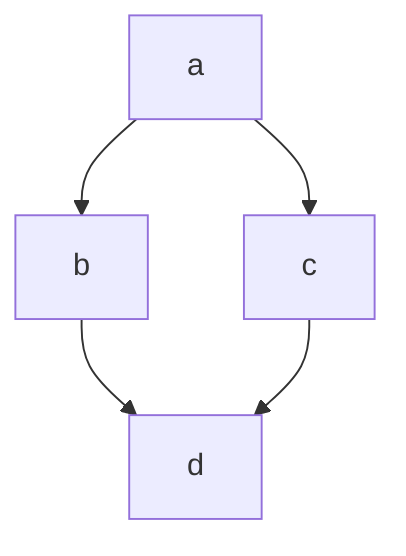

# markdown

iiii

####
####ola mundo
#### eu gosto de cachorro


Se você de espaços
entre linha, então você
 tera um novo parágrafo

Quebra de linha  
com dois espaços
ao final da linha.<br> é o mesmo \<br> que você encontra no html
==marcado==
**negrito**
__negrito__
_sublinhado_
~~riscado~~
*italico*
_italico_


Em um **parágrafo** podemos usar todos os anteriores 

## Listas

1. ordenadas
    1. subitem
2. quando você usa um número, o
3. próximo item será automaticamente incrementados

    1.subitem
    2.outro subitem
    2. outro subitem
        1. subitem

    - Não Ordenados
    * Você pode usar um asterisco ou hifen
    + Sinal de mais também é aceito
        - subitem
        - subitem
        - subitem
- O correto é não misturar os sinais


## Links

[Texto](https://google.com)

[ancora](#markdown)
[texto](https://senac.br/)


Aqui é um parágrafo com link [cliqueaqui](https://senac.com.br/ "titulo para esse link)


## imagens


## imagem com link

[]()

[](http://gmail.com)


## citação

> texto

> Iniciar minha citação
para estes problmas que eu estou passando

> <br>
> nunca desista dos seus sonhos
> <br><br>

> Citação
>> sub citação
> ### Titulo dentro de uma citação

## toggle

<details>
    <summary>
    Clique aqui para ver o conteúdo
    </summary>
    Conteúdo
</details>

## separador

---

ou pode ser 3 asteriscos

***

## checklist
## checklist
## checklist
## checklist
## checklist
## checklist

- [X] Item 1
- [X] Item 2
- [X] Item 3

## tabela

| nome | idade |
| ---- |  ---- |
|Sergio|   42  | 
|Simões| Branco|

| nome | idade |
| ----: | ----: |
|Sergio|   42  | 
|Simões| Branco|

| nome | idade |
| :----: |  :----: |
|Sergio|   42  | 
|Simões| Branco|

## código

Em linha usamos 1 acento grave para abrir o codigo e outro para fechar


` <h1> Eu sou um titulo</h1> `

<h1> Eu sou um título</h1>

` # Eu sou um título `

# Eu sou um título

` console.log('Olá, mundo!') `

### bloco de código

Usaremos 3 acentos graves para abrir, seguido da linguagem que eu quero, e para fechar mais 3 acentos graves.

``` html

<details>
    <summary>
    Clique aqui para ver o conteúdo
    </summary>
    Conteúdo
</details>

```


``` CSS

.container{
    display:flex;
    }

    ```


    ``` javascript

    console.log('Olá, mundo!');

    function dados(dados){
        console.log(dados);
    }


```


## emojis

:rocket:
:smirk:
:elephant:
:s




<!-- Comentário -->


